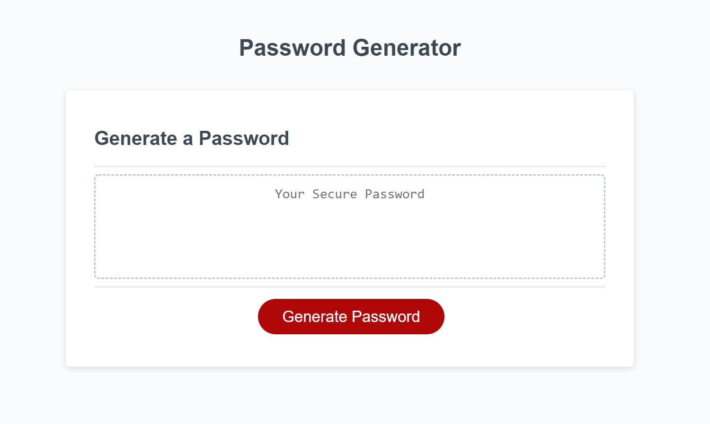
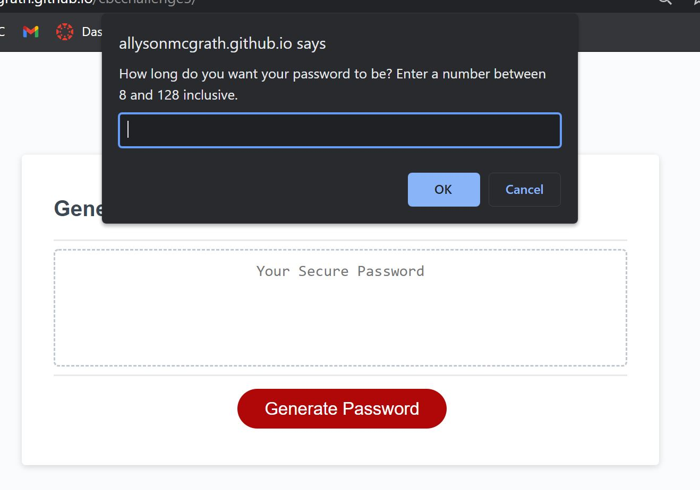

# Javascript-Password Generator

## Description

This is a project where I was given the index.html and style.css files for a basic website that will generate a randomized password. The main purpose was to demonstrate understanding of how to use Javascript (variables, functions).

I had to create multiple prompts/confirm messages for the user to input what they wanted their password to include. The site first prompts for the password length, then asks if the user wants uppercase, lowercase, numbers, and special characters to be included.

This project required creating multiple functions. I had to create a function for the generator to select randomly from all lowercase letters, and then repeat this for uppercase letters, numbers, and special characters. For most of these I used fromCharCode rather than from a string or array.

A separate function was then made to select from the kinds of characters selected by the user, which then randomizes and selects characters based on the length that the user chose and on the confirm messages.

This information is then passed into the text box above the generate button, giving the user their password.

## Installation

You can find the deployed site [here.](https://allysonmcgrath.github.io/password-generator/)

To install the entire project and access the code, you can clone the repository by using the command prompt

$ git clone https://github.com/AllysonMcGrath/cbcchallenge3.git

Detailed instructions for cloning GitHub repositories can be found [here.](https://docs.github.com/en/github/creating-cloning-and-archiving-repositories/cloning-a-repository-from-github/cloning-a-repository)

## Usage

When displaying correctly, website should look like the image below:

Use standard git commands within this repository.

Examples:

$ git mv index.html ../
$ git add .
$ git commit -m "commit description"
$ git push origin main

## Credits

Trilogy Education Services, LLC, a 2U, Inc. brand

[Coding Boot Camp at UT](https://github.com/the-Coding-Boot-Camp-at-UT)

[Xander Rapstine](https://github.com/Xandromus)

[Traversy Media](https://www.youtube.com/watch?v=duNmhKgtcsI)

[TechnicalCafe](https://www.youtube.com/watch?v=9sT03jEwcaw)

## License

MIT License

Copyright (c) 2021 Allyson McGrath

Permission is hereby granted, free of charge, to any person obtaining a copy
of this software and associated documentation files (the "Software"), to deal
in the Software without restriction, including without limitation the rights
to use, copy, modify, merge, publish, distribute, sublicense, and/or sell
copies of the Software, and to permit persons to whom the Software is
furnished to do so, subject to the following conditions:

The above copyright notice and this permission notice shall be included in all
copies or substantial portions of the Software.

THE SOFTWARE IS PROVIDED "AS IS", WITHOUT WARRANTY OF ANY KIND, EXPRESS OR
IMPLIED, INCLUDING BUT NOT LIMITED TO THE WARRANTIES OF MERCHANTABILITY,
FITNESS FOR A PARTICULAR PURPOSE AND NONINFRINGEMENT. IN NO EVENT SHALL THE
AUTHORS OR COPYRIGHT HOLDERS BE LIABLE FOR ANY CLAIM, DAMAGES OR OTHER
LIABILITY, WHETHER IN AN ACTION OF CONTRACT, TORT OR OTHERWISE, ARISING FROM,
OUT OF OR IN CONNECTION WITH THE SOFTWARE OR THE USE OR OTHER DEALINGS IN THE
SOFTWARE.
